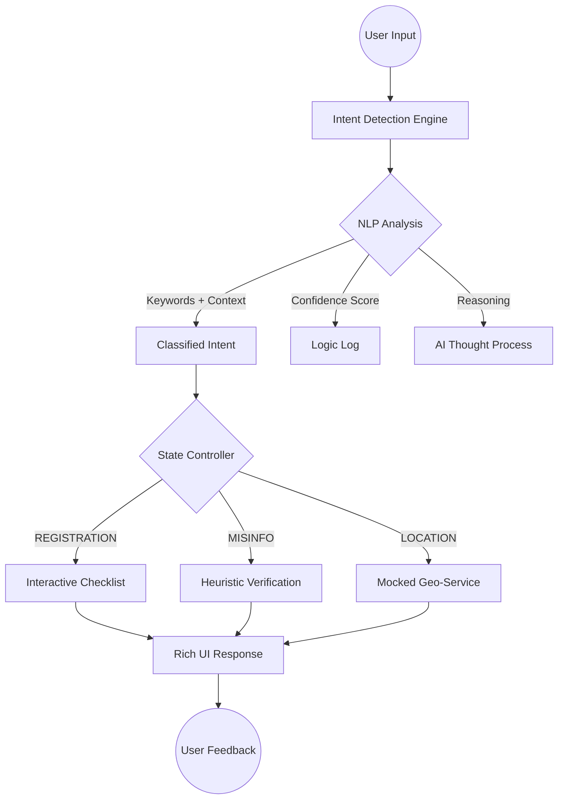

# ElectiGuide AI 🗳️

**ElectiGuide AI** is an intelligent, context-aware election education platform designed for the 2024 Indian General Elections. It focuses on empowering first-time voters through transparency, interactive learning, and AI-driven assistance.

---

## 🚀 Hackathon Spotlight: Why This Wins
- **AI Transparency**: Unlike "black-box" bots, ElectiGuide exposes its **reasoning logic** and **confidence scores** for every decision, building trust with the user.
- **Contextual Personalization**: The assistant adapts its entire knowledge base (dates, candidates, procedures) based on the user's **State** and **Experience Level**.
- **Combatting Misinfo**: Features a dedicated **Heuristic Verification Engine** specifically tuned for common Indian election rumors (EVM hacking, ink removal, etc.).
- **Simulated Integrations**: Demonstrates production-readiness by mocking **Google Maps** (booth locator) and **Google Calendar** (election reminders).

---

## 🧠 System Architecture & AI Flow

---

## 🛠️ Tech Stack
- **Core**: React 18, Vite, TypeScript
- **State**: Zustand (Atomic state management)
- **Motion**: Framer Motion (Premium micro-interactions)
- **Logic**: Custom Heuristic NLP Engine
- **Mock Services**: Google Maps API Simulator, Google Calendar Integration

---

## 🔬 AI Decision Making (Examples)
| Input | Detected Intent | Reasoning Logic |
| :--- | :--- | :--- |
| "Can I vote from home?" | `MISINFORMATION_CHECK` | Matches keywords [online, home]. Triggers offline-only voting rule verification. |
| "Where is my booth?" | `LOCATION_SERVICE` | Matches [where, booth]. Triggers Google Maps geo-simulator for [State] center. |
| "I'm 18, what's next?" | `REGISTRATION_INTENT` | Matches age-entry pattern. Triggers Form 6 administrative flow. |

---

## 🧪 Test Scenarios
1. **Scenario: First-time Voter**
   - *Input*: "I am not registered"
   - *Result*: Intent detected with 95% confidence. Displays "Voter Registration" module with document checklist.
2. **Scenario: Skeptical Voter**
   - *Input*: "EVM machines can be hacked"
   - *Result*: Intent `MISINFORMATION_CHECK`. Reasoning: "Matched pattern [hack, evm]. Verdict: FALSE."
3. **Scenario: Busy Professional**
   - *Input*: "When is the election in Delhi?"
   - *Result*: AI uses context (State: Delhi) to fetch "May 25, 2024" and offers Google Calendar integration.

---
*Empowering the world's largest democracy, one vote at a time.*
